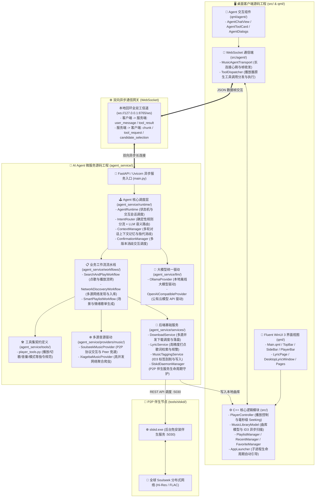
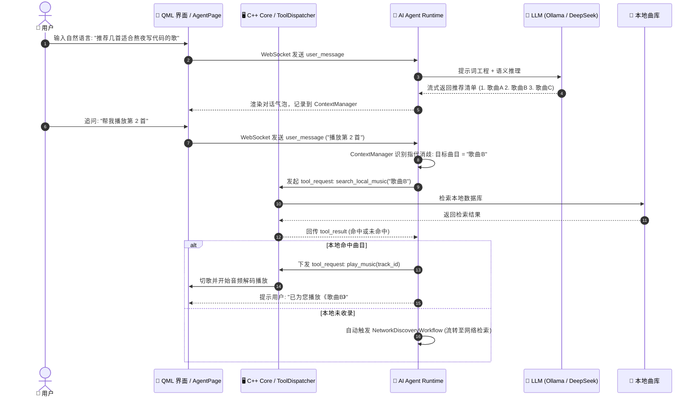
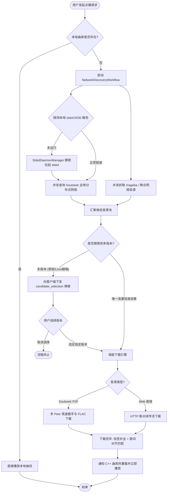

# 🎵 FluentTrackAgent

<div align="center">


<p align="center">
  <b>始于 Fluent 美学，融于智能体协同，归于自由音源——融合 WinUI 3 现代视觉与自主 Agent 的全能无损音乐播放器。</b><br>
  <i>Born for Fluent Aesthetics, Driven by AI Agent Collaboration, Powered by Free Lossless Sourcing.</i>
</p>

[✨ 核心三大亮点](#-核心三大亮点设计协同寻音) •
[🎤 智能歌词生态](#-智能歌词生态以词推歌--毫秒动态推出--桌面悬浮) •
[🎶 播放器基础体验](#-播放器基础功能全景) •
[🏛️ 系统架构与源码分层](#-系统架构与源码分层设计) •
[📊 核心业务流与关系链](#-核心业务流与关系链) •
[🛠️ 技术栈全景](#-技术栈全景) •
[🚀 本地源码获取与运行指南](#-本地源码获取构建与运行指南) •
[📫 联系作者](#-作者与联系方式)

</div>

---

## 📖 项目背景与愿景

**FluentTrackAgent** 最初源于开发者对打造一款具备 **Windows 11 Fluent WinUI 3** 极致现代桌面交互体验的音乐播放器的初心。但在开发过程中，随着人机交互技术的革新，单纯的本地音频播放已无法满足未来桌面的想象。

于是，项目全面拥抱 **AI Agent（智能体）架构**，实现了从传统播放器到“智能协同音乐终端”的跨越式蜕变。它不仅具备极具质感的本地无损播放与桌面歌词体验，更拥有能够听懂自然语言的“AI 大脑”——支持多轮上下文指代消歧、播放器原生功能深度调度，以及在本地曲库缺失时，自主接入去中心化 P2P 网络与全网音源实现免费高保真下载入库。

---

## ✨ 核心三大亮点：设计 · 协同 · 寻音

```
┌────────────────────────────────────────────────────────────────────────┐
│                        FluentTrackAgent 三大核心支柱                    │
├────────────────────┬─────────────────────────────┬─────────────────────┤
│   1. 现代 WinUI 美学 │    2. AI 智能体人机协同     │   3. 全网免费音源自由   │
│   Windows 11 视觉基底 │   自然语言理解与播放器深操   │  全球 P2P 无损极速下载 │
└────────────────────┴─────────────────────────────┴─────────────────────┘
```

### 1️⃣ Fluent Design 现代 WinUI 风格（极致桌面美学）
* **Windows 11 原生质感**：深度融合微软 Fluent Design 设计语言，支持 Mica（云母）与 Acrylic（亚克力）半透明微光磨砂效果，圆角阴影细腻自然；
* **响应式自适应布局**：平滑抽屉式侧边导航栏、沉浸式顶部搜索感知栏、动态缩放底部播放控制条；
* **双主题平滑切换**：完美契合系统级暗黑与明亮模式；
* **无边框原生窗口体验**：支持无感自由拖拽、边缘平滑缩放与原生贴靠布局（Snap Layouts）。

### 2️⃣ 智能体协同深度操控（AI Agent Collaboration）
Agent 是播放器的“第一驾驶员”。通过底层异步 WebSocket 双向 RPC 协议，Agent 拥有完备的播放器原生操作工具集，使人机交互从传统的“点选”升级为“对话协同”：

* **全方位原生工具调用（Native Tool Calling）**：
  * **精准点播与切歌**：`play_music`、`pause_music`、`resume_music`、`next_track`、`previous_track`；
  * **智能音量步进控制**：用户说“声音小一点”或“太吵了”，Agent 自动获取当前音量并进行安全步进调节（如 `volume = current - 15`）；
  * **播放模式无感切换**：`set_playback_mode` 支持在单曲循环、随机播放、列表顺序循环之间精准切换；
  * **状态感知与曲库检索**：实时调用 `get_player_state` 读取播放进度与当前歌曲，调用 `search_local_music` 毫秒级匹配本地歌曲库元数据；
  * **临时灵感歌单组装**：通过 `create_smart_playlist` 动态根据用户听歌场景一键生成并替换当前播放列表；
  * **可视化工具卡片**：前端 UI 同步渲染精美的 `AgentToolCard`，透明展示工具执行参数与结果状态。
* **听懂自然语言与多轮上下文连续推理（Continuous Reasoning & Disambiguation）**：
  * **混合意图分流架构（Intent Router）**：简单高频指令（如“暂停”、“下一首”）通过确定性规则 0ms 闪电命中；模糊诉求（如“今天加了一整天班好累，放点适合下班听的轻快民谣”）交由大模型深度理解；
  * **上下文指代消歧（Referential Context Tracking）**：支持**代词消歧**与**序数指代**。例如：
    * *用户*：“给我推荐几首孙燕姿经典的冷门歌曲。”
    * *Agent*：列出 5 首歌曲推荐清单（1.《开始懂了》 2.《雨天》 3.《尚好的青春》...）。
    * *用户*：“帮我播放**第 3 首**。”
    * *Agent*：自动从对话历史记忆中精准锁定“第 3 首”对应的曲目是《尚好的青春》，提取歌手与歌名，无缝流转至点播流水线！
  * **思维链（Chain-of-Thought）流式分离展示**：原生适配 DeepSeek-R1、Qwen 等推理大模型的 `<think>` 标签，支持折叠查看思考链，思考路径透明可追溯。

### 3️⃣ 全网免费音源自由发现（Autonomous Free Music Sourcing）
当本地曲库没有收录目标歌曲时，Agent 不会简单返回“未找到”，而是自主启动**多源网络智能发现流水线（Network Discovery Workflow）**：

* **全球去中心化 P2P 检索（Soulseek Network）**：
  * 播放器内置伴生守护服务 `slskd`，直连全球分布式 Soulseek 音乐共享网络；
  * 专为高保真烧友设计，支持下载 **Hi-Res 24bit/96kHz、FLAC 原版无损** 以及 320kbps MP3 优质音源；
  * **多 Peer 并发竞速机制（Multi-Peer Racing）**：自动过滤队列拥堵节点，最快节点优先传输，支持断点续传。
* **聚合网络音源直链提取（Xiageba Provider）**：
  * 针对主流流行音乐，聚合高并发网络爬虫通道，秒级解析高品质音频流；
  * 当音源受网盘保护时，自动提取直链并协助唤起。
* **交互式版本消歧弹窗（Track Candidate Disambiguation）**：
  * 搜索到多版本（如：原版无损、现场 Live 版、DJ 慢摇混音、官方伴奏、翻唱版）时，Agent 自动调起现代化的 **Fluent 多选版本确认对话框**，由用户确认最中意的一款版本。
* **自动化全闭环入库**：
  * 下载完成后由 `MusicTaggingService` 自动注入标准 ID3v2 / Vorbis 元数据与高清封面；
  * `LyricService` 自动检索并写入对齐的 `.lrc` 歌词文件；
  * 实时通知 C++ 播放器核心曲库热更新并立即无缝起播！

---

## 🎤 智能歌词生态：以词推歌 · 毫秒动态推出 · 桌面悬浮

歌词是音乐沉浸感的核心纽带。FluentTrackAgent 构建了一套从“碎片歌词推导识歌”到“高精度实时推出”的完整闭环：

### 1. 以词推歌（Reverse Reasoning from Lyrics to Song）
* **模糊记忆智能逆向推导**：日常听歌时，我们常常只记得一句歌词却想不起歌名（例如：“天青色等烟雨”、“能不能给我一首歌的时间”）。
* **知识库反查与自动点播**：当用户对 Agent 说出含歌词句式的指令时，Agent 结合底层大模型的音乐知识先验，能够精准反向推导出目标曲目名称与歌手，并自动调用搜歌与点播流水线，实现“记不住歌名也能放对歌”。

### 2. 高精度打点歌词多源自检索与配对（Lyric Sourcing Engine）
* **拒绝伪造时间戳**：内置 `LyricService`，坚决杜绝粗制滥造的匀速假打点；
* **全球高精度歌词库（LRCLIB）**：自动校验音频文件真实时长（容差 $\le$ 5.0s），获取官方级精准对齐时间戳；
* **酷狗公有引擎并发互备**：智能过滤短铃声与片段版本，严格提取完整歌曲时间轴；
* **双轨同名落盘**：下载音频的同时自动匹配并保存同名 `.lrc` 文件，本地扫描即刻识别。

### 3. 毫秒级动态“推出”与双向交互（Real-time Lyric Display & Interaction）
* **逐行毫秒级精准对齐与高亮推出**：音频播放到指定时间戳，歌词行平滑滚动并自动放大高亮；
* **任意歌词行点击即跳（Click-to-Seek）**：在沉浸式全屏歌词页（`LyricPage`）中，点击任意一行歌词，播放引擎瞬时精准跳转（`seekToLyric`）至该行对应的时间位置开播；
* **独立悬浮桌面歌词（DesktopLyricWindow）**：
  * 支持置顶透明悬浮窗、无边框任意拖拽位置；
  * 贴心支持**窗口拖拽锁定**与**鼠标事件穿透**，听歌、办公、码字两不误。

---

## 🎶 播放器基础功能全景

作为一款专业的桌面音乐播放器，FluentTrackAgent 具备极为扎实完善的本地播放体验：

| 模块 | 对应源码组件 | 功能特性描述 |
| :--- | :--- | :--- |
| **视觉与交互** | `qml/Main.qml`<br>`qml/components/` | 严格遵循微软 **Fluent WinUI 3** 设计规范；支持 Windows 11 云母（Mica）/ 亚克力磨砂质感；平滑的自适应响应式侧栏；暗黑/明亮双主题无缝切换；自定义无边框窗口与流畅缩放拖拽。 |
| **核心音频引擎** | `src/PlayerController.h/.cpp`<br>`Qt6 Multimedia` | 基于 `QMediaPlayer` 深度二次封装；支持 FLAC、WAV、MP3、M4A、OGG 等格式解码；毫秒级平滑 Seeking 定位；音量渐入渐出与静音控制；单曲循环 / 随机乱序 / 列表顺序播放模式。 |
| **本地曲库模型** | `src/MusicLibraryModel.h/.cpp`<br>`src/MusicTrack.h` | 多目录并行监控与智能异步扫描；精准解析 ID3v1/ID3v2、FLAC Vorbis 注释及内嵌高清晰度专辑封面；支持按歌手、专辑、流派分类检索；模糊即时搜索过滤。 |
| **歌单与历史记录** | `src/PlaylistManager.h/.cpp`<br>`src/RecentManager.h/.cpp`<br>`src/FavoriteManager.h/.cpp` | 实时记录“最近播放”足迹；一键轻量化“我的收藏”喜爱标记；自定义多歌单创建、重命名、拖拽排序与歌曲移除。 |
| **歌词解析与渲染** | `src/Lyric.h`<br>`qml/pages/LyricPage.qml`<br>`qml/components/DesktopLyricWindow.qml` | 逐行毫秒时间戳匹配；双语歌词对照跟随；独立置顶无边框桌面歌词窗口，支持锁定与鼠标穿透。 |

---

## 🏛️ 系统架构与源码分层设计

FluentTrackAgent 采用 **C++ 原生桌面客户端工程 + 异步通信网关 + 模块化 Python AI 微服务工程 + P2P 伴生节点** 的完全解耦微内核设计。整个源码仓库划分清晰、高内聚低耦合：



### 源码模块职能解耦
1. **客户端展示与引擎（`src/` & `qml/`）**：C++ 负责操作系统级进程管理、高性能音频解码、本地文件 ID3 刮削与毫秒级时钟调度；QML 负责构建丝滑的 WinUI 3 界面与动效；
2. **双向 RPC 协议（`src/agent/`）**：通过 WebSocket 实现客户端与服务端的异步解耦，以 `req_id` 驱动“指令下发 $\rightarrow$ C++ 本地执行 $\rightarrow$ 结果响应”的完整闭环；
3. **AI 业务中心（`agent_service/`）**：纯 Python 模块化分层，业务工作流（Workflows）、音源驱动（Providers）、工具定义（Tools）、会话记忆（Runtime）各司其职，具有极高的可读性与二次开发扩展性；
4. **分布式网络伴生（`tools/slskd/`）**：免配置伴生进程，专职负责全球去中心化 P2P 网络的节点穿透与分块下载。

---

## 📊 核心业务流与关系链

### 1. 自然语言点播与多轮推理时序图



### 2. 网络多源发现与音源下载状态机



---

## 🛠️ 技术栈全景

| 层次类别 | 技术选型 | 核心作用说明 |
| :--- | :--- | :--- |
| **客户端前端** | **Qt 6.8.3 (MinGW 64-bit)** | 跨平台 GUI 基础设施，提供高性能图形渲染管道与多媒体支持 |
| | **QML / QuickControls 2** | 构建响应式、现代化 Windows 11 Fluent WinUI 3 视觉效果与微动画 |
| | **C++20 标准** | 核心业务模型、音视频底层控制器、内存与对象生命周期管理 |
| | **Qt Multimedia** | 本地跨平台音频流解码、播放控制、声道与音量调制 |
| | **Qt WebSockets / Network** | 高可靠低延迟全双工 WebSocket 长连接传输层 |
| **AI Agent 服务端** | **Python 3.13** | 现代高效的 AI 逻辑胶水层与异步微服务运行时 |
| | **FastAPI + Uvicorn** | 高并发异步 Web 服务框架，提供 HTTP 探针与 WebSocket 路由接入点 |
| | **Pydantic v2** | 严格的数据结构模式校验与序列化 |
| | **HTTPX / curl-cffi** | 强健的异步网络请求，防反爬指纹伪装，高并发网络爬虫 |
| | **Mutagen & OpenCC** | 音频 ID3 标签智能刮削、内嵌写入，海内外繁简中文无损转化 |
| | **PyYAML** | 健壮安全的伴生服务配置序列化引擎 |
| **大模型生态** | **Ollama 本地大模型** | 支持离线无网运行，推荐搭配 `qwen2.5:7b`、`qwen3.5:9b`、`deepseek-r1:8b` |
| | **OpenAI 兼容协议** | 支持接入 DeepSeek-V3、Qwen-Max、Moonshot Kimi、智谱 GLM 等公有云服务 |
| **分布式音源** | **slskd (0.26.0 win-x64)** | 基于 ASP.NET Core 编写的 Soulseek P2P 伴生节点服务 |

---

## 🚀 本地源码获取、构建与运行指南

### 1. 前置依赖环境
* **操作系统**：Windows 10 / 11 (x64)
* **C++ 编译工具链**：MinGW 13.1.0 64-bit（或同版本 GCC 套件）
* **Qt 框架**：Qt 6.8.3（安装时勾选 `Qt Quick`, `QuickControls 2`, `Multimedia`, `WebSockets`, `Network` 模块）
* **构建工具**：CMake 3.20 或更高版本
* **Python 环境**：Python 3.13 (64-bit)
* **大模型运行环境（可选）**：推荐本地安装 [Ollama](https://ollama.com/) 并下载推荐模型：
  ```bash
  ollama run qwen2.5:7b
  # 或使用具备深度推理能力的模型
  ollama run deepseek-r1:8b
  ```

### 2. 克隆源码与安装 Python 依赖
```bash
# 1. 克隆代码仓库到本地
git clone https://github.com/xingzhougao/FluentTrackAgent.git
cd FluentTrackAgent

# 2. 安装 Python 微服务运行依赖
pip install fastapi uvicorn httpx pydantic pyyaml mutagen opencc-python-reimplemented curl_cffi
```

### 3. 使用 CMake 编译 C++ 客户端
```bash
# 1. 创建并进入独立构建目录
mkdir build && cd build

# 2. 使用 CMake 配置工程 (以 MinGW 为例)
cmake -G "MinGW Makefiles" -DCMAKE_BUILD_TYPE=Release ..

# 3. 启动多线程编译
cmake --build . --config Release -j8
```

### 4. 启动与体验播放器
编译完成后，直接运行生成的可执行文件即可：
```bash
./appFluentWinUI_Musicplayer.exe
```
> **提示**：播放器内置的 `AppLauncher` 进程管理器会在主程序启动时**自动引导并静默启动**后台 Python Agent 微服务（监听端口 8765）与 P2P 伴生节点（监听端口 5030），无需手动分别启动各个组件，开箱即用！

---

## 📫 作者与联系方式

* **Author**: [xingzhougao](https://github.com/xingzhougao)
* **Email**: [gxzcpp@163.com](mailto:gxzcpp@163.com)
* **GitHub Repository**: [xingzhougao/FluentTrackAgent](https://github.com/xingzhougao/FluentTrackAgent)

---

<div align="center">
  <sub>Made with ❤️ by xingzhougao. 祝您享受音乐与 AI 碰撞带来的美妙体验！</sub>
</div>
